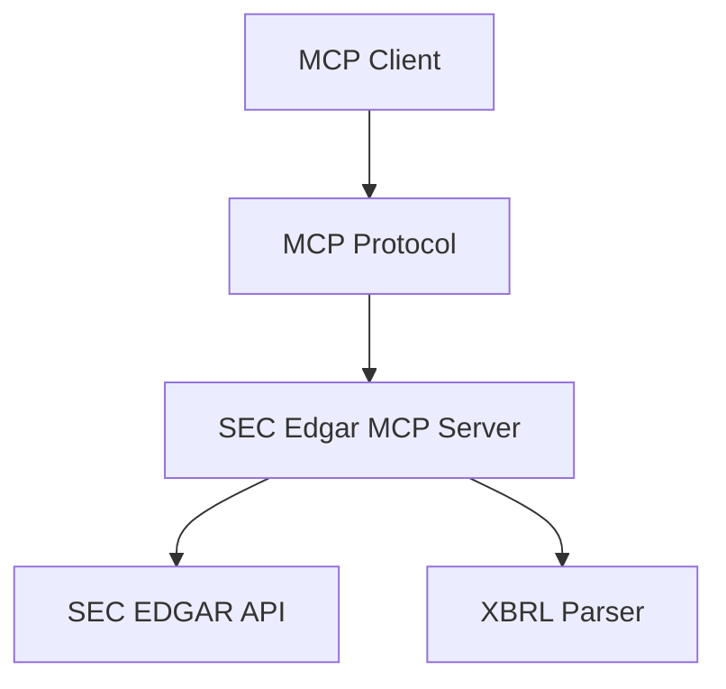

## What is MCP?

The Model Context Protocol (MCP) is an open standard that enables seamless integration between LLM applications and external data sources and tools.

## How SEC Edgar MCP Uses MCP

SEC Edgar MCP implements the MCP protocol to provide:

- **Tool Discovery**: Automatic discovery of available SEC tools
- **Structured Responses**: JSON-formatted responses with exact data
- **Error Handling**: Consistent error reporting and recovery
- **Type Safety**: Well-defined schemas for all tool parameters

## MCP Architecture

