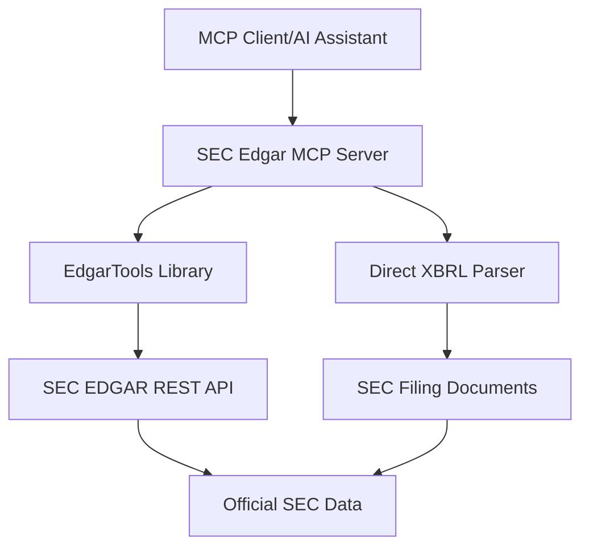

  
  

## Overview

SEC Edgar MCP is an open-source MCP (Model Context Protocol) server that connects AI models to the rich dataset of [SEC EDGAR filings](https://www.sec.gov/edgar). EDGAR (Electronic Data Gathering, Analysis, and Retrieval) is the U.S. SEC's primary system for companies to submit official filings, containing millions of filings that increase the efficiency, transparency, and fairness of securities markets.

<Note>
  **Important**: EDGAR® and SEC® are trademarks of the U.S. Securities and Exchange Commission. This open-source project is not affiliated with or approved by the U.S. Securities and Exchange Commission.
</Note>

## Key Features

<CardGroup cols={2}>
  <Card
    title="Real-time SEC Data"
    icon="chart-line"
    href="/concepts/data-sources"
  >
    Access live SEC EDGAR filings with exact precision and filing references
  </Card>
  <Card
    title="Comprehensive Tools"
    icon="wrench"
    href="/tools/overview"
  >
    Complete set of tools for company lookup, filings, financials, and insider trading
  </Card>
  <Card
    title="XBRL Parsing"
    icon="code"
    href="/tools/financial/xbrl-parsing"
  >
    Direct XBRL parsing for exact financial precision with no rounding
  </Card>
  <Card
    title="MCP Protocol"
    icon="plug"
    href="/concepts/mcp-protocol"
  >
    Built on the open Model Context Protocol standard for seamless AI integration
  </Card>
</CardGroup>

## What You Can Do

With SEC Edgar MCP, AI assistants can:

- **Company Research**: Look up companies by name, ticker, or CIK number
- **Filing Analysis**: Access and analyze 10-K, 10-Q, 8-K, and other SEC filings
- **Financial Data**: Extract exact financial statements with XBRL precision
- **Insider Trading**: Monitor Form 3, 4, and 5 insider transaction filings
- **Due Diligence**: Comprehensive corporate transparency and compliance monitoring

<Tip>
  The server leverages the [EdgarTools Python library](https://github.com/dgunning/edgartools) to fetch data from official SEC sources and performs direct XBRL parsing for exact financial precision.
</Tip>

## Architecture Overview

The SEC Edgar MCP server acts as a bridge between AI clients and SEC EDGAR data:

## Getting Started

<CardGroup cols={2}>
  <Card
    title="Quickstart"
    icon="rocket"
    href="/quickstart"
  >
    Get up and running in minutes with Docker or Python
  </Card>
  <Card
    title="Installation Guide"
    icon="download"
    href="/installation"
  >
    Detailed installation instructions for all platforms
  </Card>
</CardGroup>

## Use Cases

<AccordionGroup>
  <Accordion title="Investment Research">
    Analyze company financials, compare metrics across companies, and track filing updates for investment decisions.
  </Accordion>
  
  <Accordion title="Financial Analysis">
    Extract precise financial data from 10-K and 10-Q filings, build financial models, and perform ratio analysis.
  </Accordion>
  
  <Accordion title="Compliance Monitoring">
    Monitor insider trading activities, track regulatory filings, and ensure compliance with SEC requirements.
  </Accordion>
  
  <Accordion title="Due Diligence">
    Comprehensive corporate research for M&A, partnerships, or investment opportunities.
  </Accordion>
</AccordionGroup>

## Next Steps

Ready to get started? Follow our [Quickstart Guide](/quickstart) to set up SEC Edgar MCP in minutes, or explore our [Tools Reference](/tools/overview) to see what's possible.